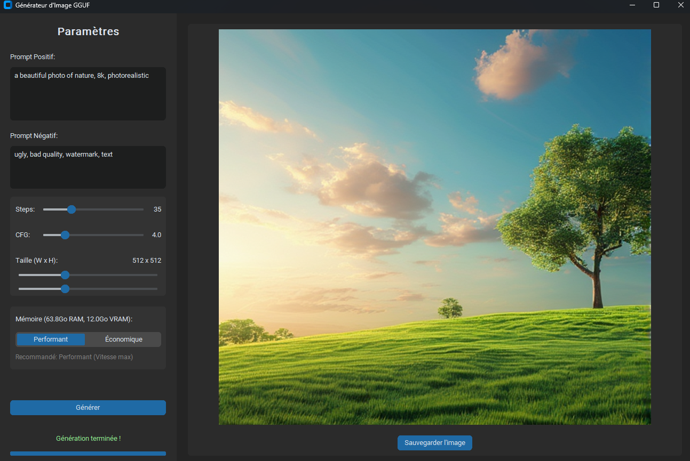

# 🎨 Chroma-app-gguf

  

> A simple, self-contained application to generate images with the Chroma model using GGUF files.

  

## ✅ Prerequisites

To use this application, your system must meet the following requirements:

- **GPU:** NVIDIA graphics card with at least **6 GB of VRAM**.
- **RAM:** **16 GB** of system memory.
- **OS:** Windows 10 or 11.

## 🛠️ Installation (First time only)

1.  Double-click on the `setup.bat` file.
2.  A command window will open. **The installation is fully automatic** and may take around 30 minutes. The script will handle the following:
    -   📥 Download and install a portable version of Miniconda.
    -   📦 Create an isolated Python environment to keep your system clean.
    -   ⚙️ Install all necessary libraries (PyTorch, etc.).
    -   🧠 Download the 3 required GGUF models directly into the `models/` folder.
3.  Once the installation is complete, the window will prompt you to press any key to close it.

## 🚀 Running the Application

To start the application, simply double-click on `run.bat`.

## ❤️ Acknowledgements and Credits

This project would not have been possible without the amazing work of the following open-source communities:

-   **ComfyUI Team** ([`github`](https://github.com/comfyanonymous/ComfyUI)) for the core code that served as inspiration.
-   **ComfyUI-GGUF Developers** ([`github`](https://github.com/city96/ComfyUI-GGUF)) for the GGUF inference nodes.
-   **Chroma Creators** ([`huggingface`](https://huggingface.co/lodestones/Chroma)) for this open-source image generation model.
-   **silveroxides** ([`huggingface`](https://huggingface.co/silveroxides/Chroma-GGUF)) for quantizing the models into the GGUF format.

## 🗺️ Roadmap (Planned Improvements)

-   [ ] Add a language switcher for the interface.
-   [ ] Implement support for multilingual prompts.